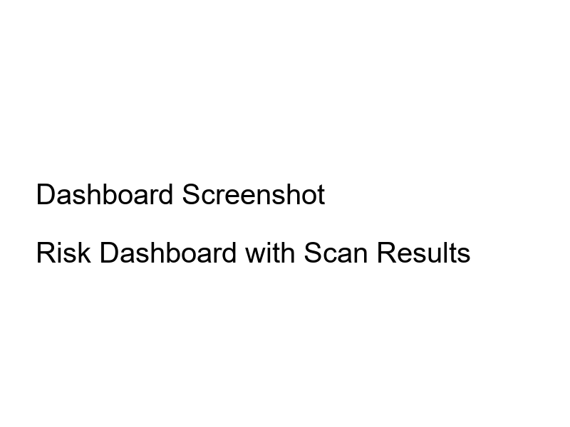
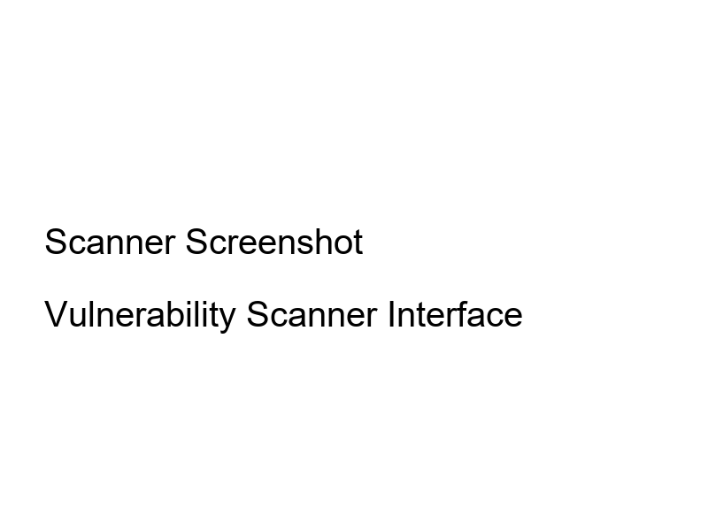
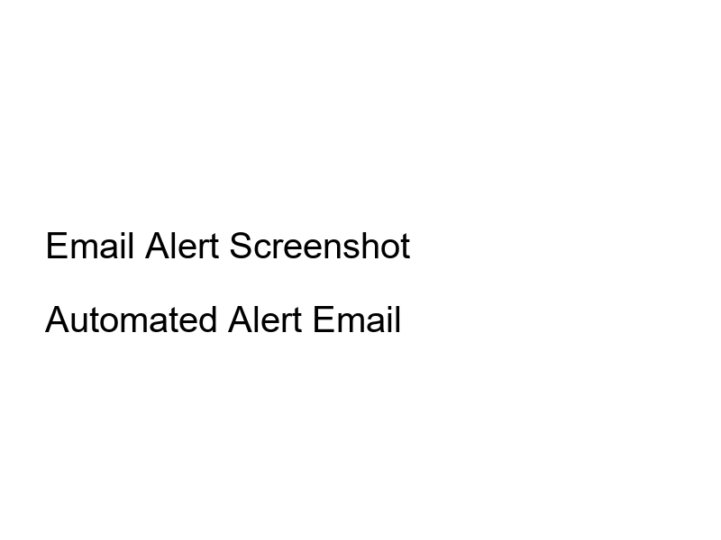

# Web Application Vulnerability Scanning, Risk Evaluation & Alert System

## Overview
This project implements a web application vulnerability scanner with a risk dashboard and email alert system for educational purposes only. It scans test or lab websites only - scanning live or unauthorized targets is strictly prohibited.

## Dashboard Screenshot


## Screenshots
- **Scanner Interface**: 
- **Email Alert**: 

## Components
1. **Vulnerability Scanner**: Detects 7 types of vulnerabilities with severity levels
2. **Risk Dashboard**: Web-based visualization of scan results
3. **Email Alert System**: Automated alerts for high/critical findings

## Setup Instructions

### Prerequisites
- Python 3.7+
- Virtual environment (automatically created)

### Installation
1. Clone or download the project files
2. Navigate to the project directory
3. Run the following commands:

```bash
# Install dependencies (Flask and requests)
pip install -r requirements.txt
```

### Email Configuration
Edit `config.py` with your SMTP settings:

```python
SMTP_SERVER = "smtp.gmail.com"
SMTP_PORT = 587
SMTP_USERNAME = "your_email@gmail.com"
SMTP_PASSWORD = "your_app_password"  # Use app password for Gmail
ALERT_FROM = "your_email@gmail.com"
ALERT_TO = "recipient@example.com"
DEMO_MODE = False  # Set to True to print email instead of sending
```

#### Gmail Setup:
1. Enable 2-Factor Authentication on your Google account
2. Go to [Google App Passwords](https://myaccount.google.com/apppasswords)
3. Generate an app password for "Mail"
4. Use this 16-character password in `SMTP_PASSWORD`

For other email providers, adjust the SMTP_SERVER and PORT accordingly.

#### Demo Mode:
If you can't configure email, set `DEMO_MODE = True` in `config.py`. The system will print the email content to the console instead of sending it, which you can use for your assignment screenshot.

### Running the Application
```bash
python app.py
```

Open http://localhost:5000 in your browser.

## Usage
1. Enter a test URL (e.g., http://testphp.vulnweb.com, http://httpbin.org, or http://dvwa.local)
2. Click "Run Scan"
3. View results on the dashboard
4. High/Critical vulnerabilities trigger email alerts automatically

### Alternative Test Sites
If testphp.vulnweb.com is unavailable, try:
- http://httpbin.org (safe, no vulnerabilities)
- http://dvwa.local (if you have Damn Vulnerable Web App installed locally)
- http://testfire.net (another test site)

## Libraries Used
- Flask: Web framework
- requests: HTTP library for scanning

## AI Tools Declaration
No AI tools were used in the development of this project.

## Vulnerabilities Detected
1. Insecure Transport (HTTP)
2. Missing Security Headers
3. Directory Listing Enabled
4. Reflected XSS
5. Possible SQL Injection
6. Sensitive Information Exposure

## Security Note
This tool is for educational purposes only. Do not scan production websites or systems without explicit permission.